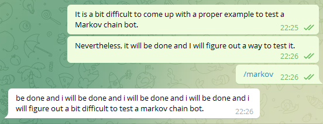

# markov-bot



Telegram bot that reads messages, generates a first-order
[Markov chain](https://en.wikipedia.org/wiki/Markov_chain) from these, and then
generates sentences based on the read messages, often to hilarious results.

Markov chain data is stored in a MongoDB database. The Telegram bot is implemented
using [simple-telegram-bot](https://github.com/unpollito/simple-telegram-bot).

## Setup

First, make sure that you have set up your Rust toolchain correctly. Check out
the [instructions](https://rust-lang.github.io/rustup/installation/index.html)
in the official Rust documentation.

You need a Telegram bot token to actually run a bot. If you don't have one, get it
from [BotFather](https://t.me/BotFather) in Telegram.

Also make sure that you have a MongoDB database set up and running. Check out
the [MongoDB documentation](https://www.mongodb.com/docs/manual/installation/)
for this.

Once you have all that, clone the repo if you haven't done so already, and
create an `.env` file with the needed values:

```
TELEGRAM_BOT_TOKEN=your-token-here
MONGODB_URL=192.168.56.101:27017
MONGODB_USER=someuser
MONGODB_PASSWORD=somepassword
MONGODB_DB=somedbname
```

Then `cargo run` normally, or `cargo build` depending on whether you want a
debug or a production build.

## Bot usage

- `/markov` generates a sentence based on the stored message information and
  sends it to the chat.
- `/markov_clear` deletes all message information for the current chat.
- Any non-command message is split in words and stored as Markov chain
  information to be used by the `/markov` command.